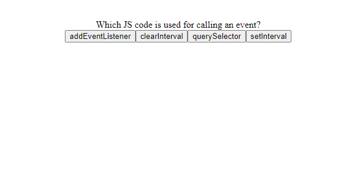
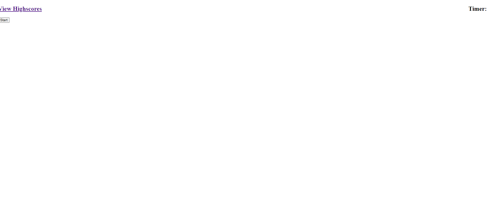

# Programming-Quizlet

## User Story

```
AS A coding boot camp student
I WANT to take a timed quiz on JavaScript fundamentals that stores high scores
SO THAT I can gauge my progress compared to my peers
```

## Acceptance Criteria

```
GIVEN I am taking a code quiz
WHEN I click the start button
THEN a timer starts and I am presented with a question
WHEN I answer a question
THEN I am presented with another question
WHEN I answer a question incorrectly
THEN time is subtracted from the clock
WHEN all questions are answered or the timer reaches 0
THEN the game is over
WHEN the game is over
THEN I can save my initials and my score
```

## Description
```
The pages has been made to go through 4 questions within 100 seconds and dependent on your team if you completed it show
what time you had left. The quiz has 2 losing condition that give you a score of 0, 1. being you just run out of time 
from not answering quick enough, 2. you answer questions wrong and it takes you to 0 seconds.

I failed take make a local storage within the time to save the score and user name onto a new html page.
```

## Images
```



```

## Links
```
Website: [Link text](https://christopher-va.github.io/Programming-Quizlet/)
Github: [Link text](https://github.com/Christopher-VA/Programming-Quizlet)
```